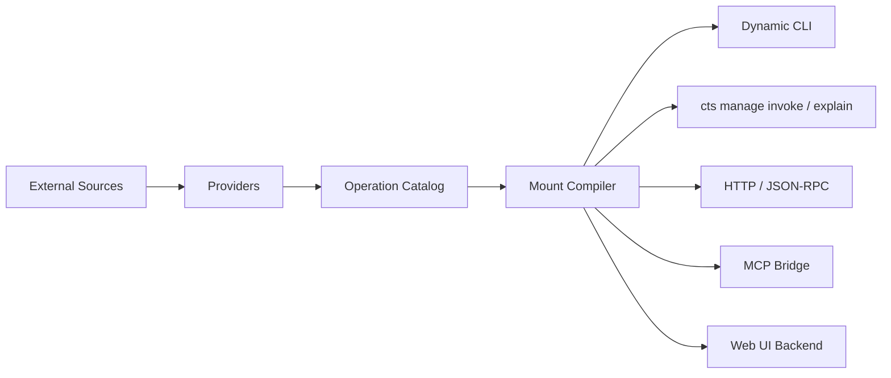

# RFC-0001: cts 统一能力平面主架构

- Status: Draft
- Authors: cts design draft
- Created: 2026-03-28
- Last Updated: 2026-03-28
- Target: cts v0.x
- Related:
  - [平台总览](01-platform-overview.md)
  - [配置模型与命令映射](02-config-model.md)
  - [Provider SDK 与接入协议](03-provider-sdk.md)
  - [运行时、执行流与安全](04-runtime-execution.md)
  - [实施路线图与工程拆分](05-implementation-plan.md)
  - [AI 友好与北向接口设计](06-ai-friendly-architecture.md)
  - [导入与参数 Schema 发现](07-import-and-schema-discovery.md)
  - [日志与可观测性](08-observability-and-logs.md)
  - [错误处理与恢复](09-error-handling-and-recovery.md)
  - [版本治理与迁移](10-versioning-and-migration.md)
  - [认证与会话生命周期](11-auth-lifecycle.md)
  - [可靠性、限流与幂等](12-reliability-and-rate-limits.md)
  - [Schema 漂移与对账](13-schema-drift-and-reconciliation.md)
  - [前端控制台](../frontend/README.md)

## 1. 摘要

本 RFC 定义 `cts` 的主架构、稳定合同、扩展边界和分阶段落地策略。

`cts` 的目标不是做一个 MCP wrapper，也不是只做一个配置驱动 CLI，而是做一个长期可扩展的统一能力平面：

- 南向接入任意能力源，例如 MCP、HTTP、OpenAPI、GraphQL、任意 CLI、Shell、plugin、内部 RPC
- 北向把统一后的能力再次暴露给人类、AI、自动化、前端和其他本地程序
- 在“可快速接入”的同时，仍然具备治理能力，包括帮助系统、日志、错误模型、认证生命周期、可靠性、版本迁移和 schema 漂移治理

本 RFC 是总纲。专题文档负责展开具体子系统，但不得与本 RFC 中的核心决定冲突。

## 2. 规范性语言

本 RFC 中出现的以下术语带规范性含义：

- MUST: 必须实现或遵守
- SHOULD: 推荐实现，除非有明确理由不这样做
- MAY: 可选实现

## 3. 背景与问题陈述

真实世界的自动化能力分散在多种接口形态中：

- 有些能力在 MCP server 中
- 有些能力只提供 HTTP 或 GraphQL API
- 有些能力只存在于成熟 CLI 中
- 有些能力只是脚本、内部 RPC 或团队自定义工具

如果每种来源都单独接入单独消费，会产生这些问题：

- 统一入口缺失
- 命令命名混乱
- 参数模型不统一
- `--help` 不可用或不可维护
- AI 和自动化系统只能依赖脆弱的人类命令路径
- 日志、错误、认证、重试各做各的
- 前端控制台不得不重复实现一套解析逻辑

`cts` 要解决的不是“如何把一个协议跑通”，而是“如何让多种协议在一个统一合同下长期演进”。

## 4. 目标

`cts` MUST 满足以下目标：

1. 支持多种 southbound 能力源，而不是绑定某一种协议。
2. 把所有能力归一为统一 `operation` 模型。
3. 允许把 operation 动态挂载为层级命令，并完整支持动态 `--help`。
4. 提供稳定机器入口，不要求 AI 或脚本依赖命令路径。
5. 支持 schema 发现、schema provenance、schema drift 检测与对账。
6. 统一错误模型、日志模型、认证生命周期与可靠性策略。
7. 支持未来接入任意 API、任意 CLI、任意 plugin，而不推翻核心架构。
8. 支持本地前端控制台，但前端不得绕过 `cts` 自己的数据模型和治理层。

## 5. 非目标

第一阶段 `cts` 不以以下事项为目标：

1. 替代每个专用工具的完整交互体验。
2. 自动完美反射任意未知 CLI。
3. 在第一版覆盖所有协议高级能力，例如 streaming、job orchestration、复杂补偿事务。
4. 取代密钥管理系统、CI 系统或服务编排系统。

## 6. 关键决定

本 RFC 明确做出以下决定。

### 6.1 Python 作为核心运行时

`cts` 核心 SHOULD 使用 Python 构建。

理由：

- 更适合做多协议编排层、配置层、执行层和治理层
- 便于统一模型、日志、错误、策略和前端 backend
- 对 CLI、HTTP、subprocess、SQLite、schema 处理更平衡

结论：

- Node 不是核心宿主
- `mcp-cli` 作为一个现成 southbound adapter 使用
- 如未来需要 JS-only SDK，可通过 plugin 或外部 adapter 接入

### 6.2 MCP 只是内置 Provider，不是架构中心

`cts` MUST 不以 MCP 为中心建模。

结论：

- MCP 是一种 source/provider 类型
- HTTP、OpenAPI、CLI、Shell、plugin 与 MCP 在架构地位上应对等
- 所有 northbound 能力不得绑定某一个 southbound 协议

### 6.3 稳定机器合同优先于命令路径

以下对象 MUST 作为稳定机器合同：

- `mount.id`
- `machine.stable_name`
- `cts manage invoke <mount-id>`
- `cts manage explain <mount-id>`
- capability card 的核心字段
- `ErrorEnvelope.type/code`

以下对象 SHOULD 视为人类 UX：

- `command.path`
- `alias`
- 帮助文本排序和展示风格

### 6.4 动态命令必须是一等能力

动态挂载命令 MUST 不只是“能执行”，还必须支持：

- `--help`
- 参数说明
- 示例
- 补全
- 风险提示
- 稳定 machine entry 对照信息

### 6.5 前端只能通过 `cts` backend 读数据

前端页面 MUST NOT 直接读取本地配置文件。

正确模式 MUST 是：

1. `cts` 读取配置、缓存、catalog、run history
2. `cts` 暴露本地 HTTP API
3. 前端通过 API 展示结构化状态

### 6.6 导入不是一次性动作

`cts` MUST 同时设计：

- discovery
- schema import
- schema provenance
- drift detection
- reconcile policy

否则动态命令、动态 `--help` 和前端表单会在上游变化后静默失效。

## 7. 核心术语

### 7.1 Source

能力来源，例如：

- MCP server
- HTTP endpoint 集合
- OpenAPI spec
- GraphQL endpoint
- CLI binary
- 脚本目录
- plugin / 内部 RPC

### 7.2 Operation

统一抽象后的能力单元。一个 operation 描述“能做什么”。

### 7.3 Mount

把 operation 挂载进 `cts` 命令树或稳定机器入口的配置对象。一个 mount 描述“如何调用”。

### 7.4 Provider

负责发现、描述、执行某类 source 的接入器。一个 provider 描述“如何接入和执行”。

### 7.5 Surface

`cts` 对外再次暴露统一能力的 northbound 接口，例如：

- 动态 CLI
- `invoke`
- HTTP
- JSON-RPC
- MCP bridge
- Web UI

### 7.6 Profile

运行上下文，例如环境、默认认证、输出偏好、策略覆盖。

## 8. 架构总览

`cts` 采用“source -> operation -> mount -> surface”的主链路。



其分层如下：

1. Config / Registry 层：加载配置、合并 profile、解析 source/mount/policy/surface
2. Provider 层：接入 southbound 协议
3. Discovery / Schema 层：发现 operation，归一化 schema 和 provenance
4. Composition 层：支持 workflow / composite operation
5. Execution 层：参数验证、鉴权、可靠性、日志、错误、审计
6. Surface 层：动态 CLI、稳定机器入口、serve 模式、前端 backend

## 9. 统一对象模型

`cts` MUST 以统一对象模型隔离具体协议。

### 9.1 Source

Source SHOULD 至少具备：

- `type`
- `enabled`
- `description`
- `profile_scope`
- `auth_ref`
- `compatibility`
- `reliability`
- `drift_policy`
- `expose_to_surfaces`

### 9.2 OperationDescriptor

OperationDescriptor MUST 至少具备：

- `id`
- `source`
- `provider_type`
- `title`
- `kind`
- `risk`
- `input_schema`
- `output_schema`
- `supported_surfaces`

Operation 是架构中最重要的协议无关对象。

### 9.3 Mount

Mount MUST 至少具备：

- `id`
- `source`
- `operation` 或 `select`
- `command`
- `machine.stable_name`

Mount MAY 具备：

- `help`
- `policy`
- `reliability`
- `drift_policy`
- `transform`

### 9.4 Capability Card

Capability card MUST 作为 northbound 标准描述存在。

建议字段：

- `mount_id`
- `stable_name`
- `command_path`
- `summary`
- `risk`
- `input_schema`
- `output_schema`
- `supported_surfaces`
- `requires_confirmation`
- `supports_dry_run`

## 10. 配置模型原则

配置层 MUST 支持三层叠加：

1. 全局配置
2. 项目配置
3. 临时覆盖，例如环境变量、`--profile`、`--set`

推荐顶层结构：

```yaml
version: 1
app: {}
imports: []
auth_profiles: {}
compatibility: {}
reliability: {}
drift: {}
profiles: {}
sources: {}
mounts: []
aliases: []
surfaces: {}
policies: {}
defaults: {}
logging: {}
```

设计原则：

- 单文件配置 MUST 继续兼容
- 分文件配置 SHOULD 作为长期推荐模式
- 运行时 MUST 编译成单一统一内存模型
- Secret SHOULD NOT 写入共享项目配置
- `auth_ref` SHOULD 替代 source 内联明文凭证
- 写操作 SHOULD 显式声明 reliability 与 drift policy
- `mount.id` MUST 视为长期稳定合同

### 10.1 分文件配置

当 source、mount、workflow、auth profile 增多时，单文件会迅速膨胀。

因此 `cts` SHOULD 支持：

- 根配置文件
- `imports`
- 相对路径导入
- glob 导入
- 递归导入
- 冲突检测
- 来源追踪

推荐结构：

```text
.cts/
  cts.yaml
  auth/
    github.yaml
    jira.yaml
  profiles/
    dev.yaml
    prod.yaml
  sources/
    mcp/
      bing.yaml
      github.yaml
    http/
      jira.yaml
  mounts/
    bing.yaml
    jira.yaml
  workflows/
    triage.yaml
```

根配置 SHOULD 尽量保持精简，例如：

```yaml
version: 1

imports:
  - ./auth/*.yaml
  - ./profiles/*.yaml
  - ./sources/**/*.yaml
  - ./mounts/**/*.yaml
  - ./workflows/**/*.yaml
```

### 10.2 合并语义

分文件配置加载 SHOULD 满足：

1. 先加载 imported fragments
2. 再应用当前文件本身
3. 后加载的 root config 覆盖先加载的 root config

推荐语义：

- 顶层映射对象递归合并
- `mounts`、`aliases` 这类顶层列表追加合并
- 同一 source/profile/policy 的后定义字段覆盖前定义字段

### 10.3 路径解析语义

一旦支持分文件，`manifest`、`config_file`、本地 schema 文件等相对路径 MUST 相对“声明它的那个文件”解析，而不是统一相对根文件解析。

这是分文件配置正确工作的必要条件。

## 11. Southbound Provider 模型

`cts` MUST 通过统一 provider 协议接入外部能力。

Provider SHOULD 至少支持：

- `discover()`
- `get_operation()`
- `get_schema()`
- `get_help()`
- `plan()`
- `invoke()`
- `healthcheck()`

可选增强：

- `auth_bootstrap()`
- `refresh_auth()`
- `complete()`
- `stream_invoke()`

### 11.1 第一阶段内置 Provider

第一阶段 SHOULD 内置：

- `mcp_cli`
- `http`
- `cli`

第二阶段 SHOULD 增加：

- `openapi`
- `graphql`
- `shell`
- `plugin`

### 11.1.1 Plugin 作为扩展机制，而不只是一个 source 类型

`plugin` 在 `cts` 中有两层含义，文档里必须严格区分：

1. `source.type=plugin`
   - 表示某个 southbound source 通过通用 plugin bridge 接入
2. plugin extension
   - 表示第三方扩展包给 `cts` 注册新的 provider type、hook handler，甚至未来的新 surface

长期设计上，第二层更关键，因为它决定：

- 新 API / 内部 RPC / 专有协议是否需要改核心
- 不同团队能否把自己的 provider 独立发布
- 核心 execution/help/catalog/logging 合同能否保持稳定

因此 `cts` MUST 支持：

- 内置 provider
- plugin 注册 provider type
- source 直接使用 plugin 注册出来的 `type`

### 11.2 CLI 集成策略

CLI 是长期第二核心，架构上 MUST 正式支持。

CLI 接入 SHOULD 分层：

1. Manifest-first
2. 半自动导入
3. 专用 adapter

结论：

- 不能把 CLI 接入仅视为 subprocess 小功能
- CLI 帮助、参数、schema、风险、输出模式都必须进入统一模型

### 11.3 MCP 集成策略

MCP 第一阶段 SHOULD 通过 `mcp-cli` 适配。

演进路径：

- 先通过 subprocess + `mcp-cli` 跑通 invoke 和 discovery
- 后续 MAY 增加 `mcp_native` provider
- 上层 operation/mount/surface 模型不得因 transport 切换而改变

## 12. Discovery、Schema 与动态帮助

`cts` 的动态命令树、动态 `--help`、前端表单和 AI capability card，都依赖 discovery 层。

### 12.1 Schema 来源分级

Schema provenance MUST 标注来源和可信度。

建议分级：

- `authoritative`
- `declared`
- `probed`
- `inferred`
- `manual`

### 12.2 动态 `--help`

动态挂载命令的 `--help` MUST 由统一 help compiler 生成。

帮助信息优先级 SHOULD 为：

1. mount `help` 覆盖
2. operation descriptor 中的 schema/description/examples
3. provider 原生帮助片段
4. 运行时补充信息，例如风险、surface、默认值、稳定 machine entry

### 12.3 CLI / MCP 参数获取

不同 source 的参数获取方式不同：

- MCP: 可通过 `mcp-cli` discovery / probe 获取
- OpenAPI: 来自 spec
- GraphQL: 来自 introspection
- CLI: 优先 manifest，其次 `--help`、completion、machine-readable schema
- 手工 HTTP: 依赖配置和人工 override

因此参数获取 MUST 被设计成独立层，而不能散落在各个执行器内部。

### 12.4 Plugin Provider 扩展合同

plugin provider 和内置 provider 在架构地位上 SHOULD 对等。

也就是说，一个 plugin 注册的新 provider type，进入内核之后应与 `http`、`cli`、`mcp` 一样：

- 参与 discovery
- 参与 schema/help 编译
- 参与 `invoke` / `explain`
- 参与 catalog 导出
- 参与日志、错误、run history

核心层不应区分“这是内置 provider 还是 plugin provider”，除非进入版本/安全治理阶段。

## 13. 执行模型

Execution 层 MUST 统一处理：

- 参数验证
- source / mount / operation 解析
- 鉴权注入
- 风险检查
- timeout / retry / rate limit / idempotency
- provider 调用
- 输出格式化
- 错误归一化
- 审计与日志

### 13.1 稳定机器入口

`cts manage invoke <mount-id>` MUST 作为机器入口首选。

原因：

- 不依赖命令路径
- 不依赖帮助文本
- 更适合脚本、CI、agent、前端 backend

### 13.2 Explain / Dry-run

`cts manage explain <mount-id>` 和 `--dry-run` SHOULD 视为第一阶段一等能力。

Explain 输出 SHOULD 至少包含：

- 命中的 mount / source / provider / operation
- 归一化后的参数
- 风险等级
- 是否需要确认
- 将访问的 URL、CLI argv 或 MCP target

### 13.3 全链路 Hook 模型

除了 provider 扩展，核心链路还 MUST 支持统一 hook。

hook 不是零散 callback，而是一套正式的生命周期扩展面。至少 SHOULD 覆盖：

- `discovery.before|after|error`
- `help.before|after`
- `explain.before|after|error`
- `invoke.before|after|error`
- `surface.http.request.before|after|error`

后续 MAY 继续扩展到：

- `config.load.after`
- `auth.refresh.before|after|error`
- `policy.before|after|blocked`
- `workflow.step.before|after|error`

Hook 的基本原则 MUST 为：

- 事件名稳定
- payload 结构可演进但不可随意破坏
- before hook 可以做有限输入改写
- after hook 可以做有限结果增强
- error hook 不能默默吞掉主错误，除非显式声明 fail mode
- hook 与日志、run_id、trace_id 复用同一条链路

## 14. Northbound Surface 模型

统一能力 MUST 能被多种 northbound surface 再消费。

### 14.1 动态 CLI

面向人类。

### 14.2 `invoke`

面向 AI、脚本、CI 和前端 backend。

### 14.3 HTTP / JSON-RPC

面向本地程序和前端。

### 14.4 MCP Bridge

用于把 `cts` 已挂载能力再次暴露成 MCP server。

这一步是 `cts` 从“工具消费者”升级为“统一能力网关”的关键。

### 14.5 Web UI

Web UI SHOULD 只消费 `cts` 自己的 northbound HTTP API。

前端 SHOULD 展示：

- 配置状态
- source 列表
- mount 列表
- 动态命令路径
- 稳定 machine entry
- schema / example / help
- auth 状态
- 最近执行历史和错误摘要

## 15. 认证与会话生命周期

认证 MUST 作为一等系统存在，而不是 source 内部的一段临时配置。

推荐模型：

- `auth_profiles`: 声明认证方式和凭证来源
- `auth_ref`: source 引用的认证配置
- `auth sessions`: 运行时会话状态

系统 SHOULD 支持：

- env token
- keyring
- OAuth2 / device flow
- CLI delegated auth
- provider refresh hook

前端和 AI SHOULD 看到认证状态，而不是凭证本身。

## 16. 可靠性、错误与日志

### 16.1 可靠性

可靠性 MUST 由 execution 层统一治理，而不是由各 provider 各自决定。

第一阶段 SHOULD 建立统一语义：

- timeout
- retry
- backoff
- rate limit
- idempotency

同时 SHOULD 给 hook 留治理入口，例如：

- retry 前后 hook
- auth refresh hook
- policy blocked hook
- 结果脱敏 hook

### 16.2 错误模型

错误 MUST 归一化为稳定结构。

`ErrorEnvelope` SHOULD 至少包含：

- `type`
- `code`
- `message`
- `retryable`
- `user_fixable`
- `run_id`
- `trace_id`
- `suggestions`

### 16.3 日志与审计

系统 MUST 提供：

- app log
- audit log
- run history

且 MUST 贯穿：

- config load
- discovery
- schema import / probe
- help compile
- invoke
- surface request

## 17. 版本治理、兼容性与 Drift

`cts` 的长期稳定性，不只取决于代码，还取决于版本治理。

### 17.1 需要治理的对象

至少包括：

- 配置版本
- Provider SDK 版本
- 上游 API / CLI / MCP 版本
- catalog / capability contract 版本
- cache / state schema 版本
- frontend API 版本

### 17.2 稳定合同

以下对象 SHOULD 尽量长期稳定：

- `mount.id`
- `machine.stable_name`
- `cts manage invoke` 语义
- `ErrorEnvelope.type/code`
- capability card 核心字段

### 17.3 Drift

上游 schema 漂移 MUST 被正式纳入生命周期。

系统 SHOULD 支持：

- fingerprint snapshot
- diff
- impact analysis
- reconcile policy
- freeze / warning / manual review

## 18. 安全边界

第一阶段 MUST 至少建立以下边界：

1. CLI / shell source 默认保守，优先 allowlist 和 manifest-first。
2. 写操作 MUST 有风险分级。
3. 高风险 mount SHOULD 支持 profile / surface 限制。
4. Secret MUST 被脱敏，且不应写入共享配置。
5. `--non-interactive` 模式下，禁止含糊的人类式确认流程。

## 19. 实现路线

### 19.1 Phase 0

完成架构文档、统一模型和 contract 定义。

### 19.2 Phase 1

最小可运行闭环：

- 配置加载
- registry
- HTTP provider
- CLI provider
- MCP provider via `mcp-cli`
- `invoke`
- `explain`
- `sync`
- `inspect`
- 动态命令树
- 动态 `--help`

### 19.3 Phase 2

规模化导入与 northbound 扩展：

- OpenAPI
- GraphQL
- plugin / hook foundation
- serve 模式
- Web UI
- config migration assistant
- compatibility checker
- drift detection

### 19.4 Phase 3

治理与生态：

- 外部 plugin 协议
- hook filtering / ordering / condition / async model
- auth lifecycle 完整实现
- rate limit / budget center
- provider SDK versioning
- schema drift reconcile workflow

## 20. 备选方案与否决结论

### 20.1 方案 A：Node 作为核心，围绕 `mcp-cli` 建系统

否决原因：

- 会让 MCP 过度成为中心
- 不利于 CLI、HTTP、配置治理、日志治理和前端 backend 的统一
- 不利于未来多语言 plugin 和复杂治理层扩展

### 20.2 方案 B：只做动态命令树，不做稳定机器入口

否决原因：

- AI 和脚本将依赖脆弱路径
- 路径重构会破坏自动化
- 无法形成稳定 contract

### 20.3 方案 C：前端直接读本地 YAML 和 cache

否决原因：

- 安全边界差
- 浏览器环境不可行
- 会复制一套配置和治理逻辑

## 21. 未决问题

以下事项已识别，但可在实现阶段继续收敛：

1. CLI manifest 的正式版本规范是否单独出 RFC。
2. plugin 协议第一版采用 JSON-RPC over stdio 还是 NDJSON over stdio。
3. `serve http` 与 `serve jsonrpc` 是否共用一套 surface runtime。
4. workflow 的补偿模型第一阶段是否仅记录，不自动执行。
5. capability card 的最终字段是否需要独立版本号。

这些问题的结论不得推翻本 RFC 的主链路和稳定合同。

## 22. 验收标准

当以下条件成立时，可认为 RFC-0001 在工程上被满足：

1. 可以通过配置接入至少一种 HTTP source、一种 CLI source、一个 MCP source。
2. 每种 source 至少有一个 operation 被成功 mount。
3. 动态挂载命令可以执行，且 `--help` 可用。
4. `cts manage invoke <mount-id>` 和 `cts manage explain <mount-id>` 能稳定输出结构化 JSON。
5. 配置、discovery、执行、错误、日志使用统一模型。
6. 前端页面通过 `cts` backend API 成功展示 source、mount、schema 与 auth 状态。
7. 上游 schema 变化时，系统能检测并给出 drift 结果。

## 23. 与专题文档的关系

本 RFC 提供主架构和关键决定。

专题文档负责以下展开：

- 详细配置字段与示例：见 [配置模型与命令映射](02-config-model.md)
- Provider 协议与接入细节：见 [Provider SDK 与接入协议](03-provider-sdk.md)
- 执行与 northbound 细节：见 [运行时、执行流与安全](04-runtime-execution.md)
- AI/Agent 友好能力：见 [AI 友好与北向接口设计](06-ai-friendly-architecture.md)
- schema 导入细节：见 [导入与参数 Schema 发现](07-import-and-schema-discovery.md)
- 日志、错误、auth、可靠性、drift、migration：见专题文档 08-13

若专题文档与本 RFC 冲突，以本 RFC 为准，并在后续修正文档中统一口径。
