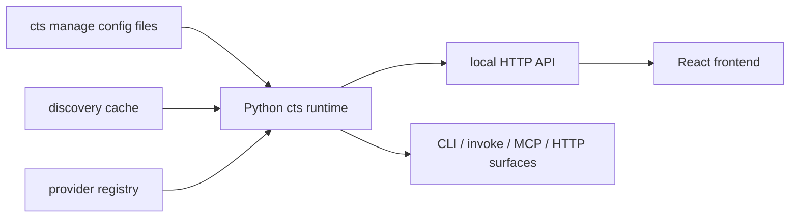

# UI 架构与数据流

## 1. 总体架构

建议采用：

- `frontend/` 独立前端工程
- `cts` Python 进程提供本地 API
- 前端通过 HTTP 拉取只读数据

推荐架构图：



## 2. 为什么前端不能直接读配置文件

原因有三类：

- 浏览器安全模型限制本地文件读取
- 配置文件并不是最终视图，需要经过 profile 合并、alias 解析、mount 展开和 catalog 生成
- 未来如果配置来源不只是一份 YAML，而是全局配置 + 项目配置 + discovery cache，直接在前端重做一遍解析会造成双逻辑

结论：

- 前端读取“后端归一化结果”
- 后端读取“真实配置源”

## 3. 前端分层

建议前端内部也分层。

### 3.1 App Shell

负责：

- 路由
- 布局
- 顶部状态栏
- profile 切换展示

### 3.2 Data Access 层

负责：

- 调用 `/api/*`
- 缓存查询结果
- 管理刷新与错误状态

推荐用 TanStack Query。

### 3.3 Feature 层

建议拆成：

- `dashboard`
- `sources`
- `mounts`
- `catalog`
- `settings`

### 3.4 Shared UI 层

公共组件：

- 表格
- Badge
- JSON viewer
- Schema viewer
- Search bar
- Copy button
- Empty state

## 4. 推荐前端目录

```text
frontend/app/
  index.html
  package.json
  src/
    main.tsx
    app/
      router.tsx
      layout.tsx
    pages/
      dashboard.tsx
      sources.tsx
      mounts.tsx
      mount-detail.tsx
      catalog.tsx
    components/
      source-table.tsx
      mount-table.tsx
      schema-viewer.tsx
      risk-badge.tsx
      surface-badges.tsx
    features/
      dashboard/
      mounts/
      sources/
      catalog/
    lib/
      api.ts
      query-client.ts
      format.ts
      types.ts
```

## 5. 页面数据流

### 5.1 启动流程

```text
cts manage serve http --ui
-> 读取 config + cache
-> 构建 registry + catalog
-> 启动 API
-> 托管前端页面
-> 前端加载 /api/app/summary
-> 再并发加载 /api/sources /api/mounts /api/catalog
```

### 5.2 Dashboard 数据来源

- `/api/app/summary`
- `/api/sources`
- `/api/mounts`

### 5.3 Mount 详情页数据来源

- `/api/mounts/:mount_id`
- `/api/catalog/:mount_id`
- `/api/explain/:mount_id` 可选

## 6. 页面交互建议

### 6.1 Mount 列表交互

支持：

- 关键字搜索
- 风险筛选
- source 筛选
- surface 筛选
- 展开 schema
- 复制命令

### 6.2 Mount 详情交互

支持：

- 查看 capability card
- 查看输入 schema
- 查看 explain 结果
- 复制 `cts manage invoke` 示例
- 复制人类路径示例

## 7. 状态管理建议

不要在第一版引入重状态管理库。

建议：

- 服务器状态用 TanStack Query
- 界面筛选状态用 URL query params
- 少量本地 UI 状态用 React state

## 8. 错误处理

前端应区分三类错误：

- API 不可用
- 配置加载失败
- catalog 为空

不要只显示“加载失败”，而应给用户明确提示：

- 当前读的是哪份配置
- 是配置为空、服务未启动，还是解析报错

## 9. 长远演进

这套前端未来可以演进成：

- Web 管理页
- Electron/Tauri 桌面壳
- 内部运维控制台

但前提是继续坚持：

- 前端不重写核心逻辑
- 统一通过 `cts` 后端服务读取规范化数据
